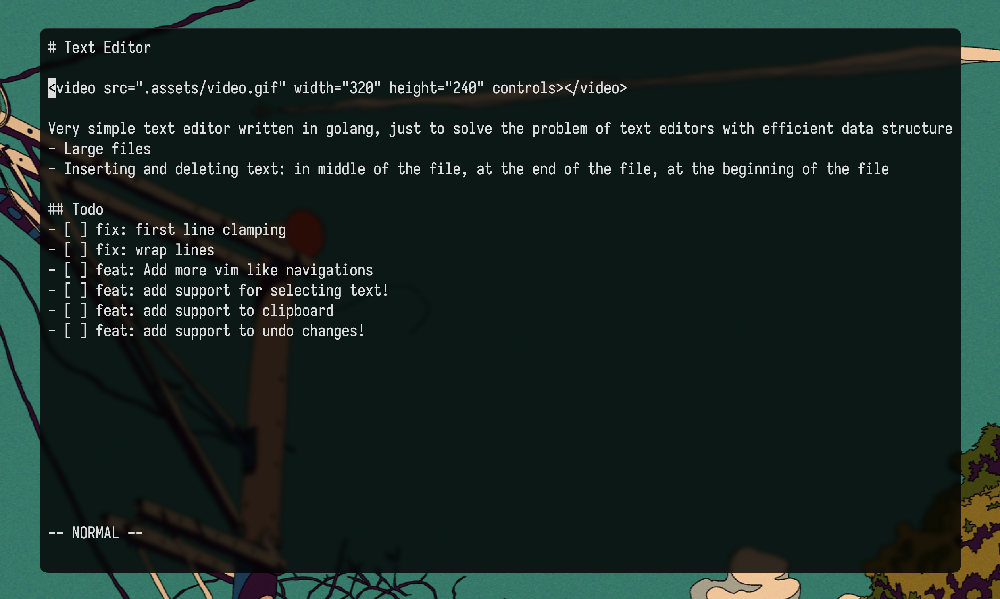

# Text Editor

  

Very simple text editor written in golang, just to solve the problem of text editors with efficient data structures, to handle:
- Large files
- Inserting and deleting text: in middle of the file, at the end of the file, at the beginning of the file

## Todo
- [ ] fix: first line clamping
- [ ] fix: wrap lines
- [ ] feat: Add more vim like navigations
- [ ] feat: add support for selecting text!
- [ ] feat: add support to clipboard
- [ ] feat: add support to undo changes! 
